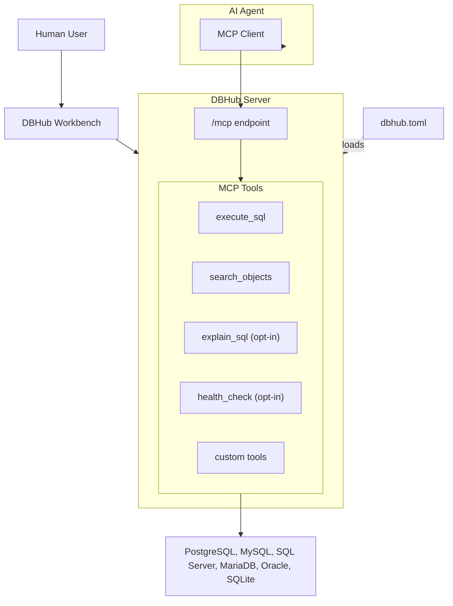

DBHub is a minimal MCP server: token-efficient, zero-dependency, and just two tools by default with opt-in extras. This lightweight gateway allows MCP-compatible clients to connect to and explore different databases.

```
 +------------------+    +--------------+    +------------------+
 |                  |    |              |    |                  |
 |  Claude Desktop  +--->+              +--->+    PostgreSQL    |
 |                  |    |              |    |                  |
 |  Claude Code     +--->+              +--->+    SQL Server    |
 |                  |    |              |    |                  |
 |  Cursor          +--->+    DBHub     +--->+    Oracle        |
 |                  |    |              |    |                  |
 |  VS Code         +--->+              +--->+    SQLite        |
 |                  |    |              |    |                  |
 |  Other Clients   +--->+              +--->+    MySQL         |
 |                  |    |              |    |                  |
 |                  |    |              +--->+    MariaDB       |
 |                  |    |              |    |                  |
 +------------------+    +--------------+    +------------------+
     MCP Clients           MCP Server             Databases
```

> DBHub is the official example in the [Claude Code docs](https://code.claude.com/docs/en/mcp#example-query-your-postgresql-database) for connecting to PostgreSQL via MCP.

## Token Efficiency

DBHub loads just 2 tools by default at **1.4k tokens** — 13-14x fewer than alternatives — keeping the context window open for your actual work.

| MCP Server | Default Config | Default Tools |
|------------|---------------|--------------|
| **DBHub** | **1.4k** | 2 (`execute_sql`, `search_objects`) |
| MCP Toolbox | 19.0k | 28 |
| Supabase MCP | 19.3k | all |

## Use Cases

- **Local Development**: Schema exploration, query validation, and data debugging with Claude Code, VS Code, Cursor, etc.
- **Non-Technical Access**: Expose curated, read-only views to non-technical staff via Claude Desktop, VS Code, Cursor, etc.
- **Multi-Database Consolidation**: Replace separate MCP servers for each database with a single DBHub process
- **Production Troubleshooting**: Read-only diagnostics with guardrails against runaway queries

## Supported Databases

PostgreSQL, MySQL, SQL Server, MariaDB, Oracle, and SQLite.

## Why DBHub?

DBHub brings powerful database capabilities to AI coding assistants:

- **Minimal**: Zero dependency, token efficient with a minimal set of MCP tools to maximize context window
- **Multi-Database**: PostgreSQL, MySQL, MariaDB, SQL Server, Oracle, and SQLite through a single interface
- **Multi-Connection**: Connect to multiple databases simultaneously with TOML configuration
- **Guardrails**: Read-only mode, row limiting, and query timeout to prevent runaway operations
- **Secure Access**: SSH tunneling and SSL/TLS encryption

## Key Features

### MCP Tools

DBHub provides AI assistants with direct database access through these tools:
- **[execute_sql](/tools/execute-sql)**: Run queries with transaction support and safety controls
- **[search_objects](/tools/search-objects)**: Explore schemas, tables, columns, indexes, and procedures
- **[explain_sql](/tools/explain-sql)** (opt-in): Show a query's execution plan without running it
- **[health_check](/tools/health-check)** (opt-in): Report connection pool state and buffer cache hit ratio
- **[Custom Tools](/tools/custom-tools)**: Define reusable, parameterized SQL operations

### Workbench

A [web-based interface](/workbench/overview) for running database tools and viewing request traces without requiring an MCP client.

## Architecture



DBHub acts as a gateway between databases and AI agents. AI agents access databases through the `/mcp` endpoint using MCP tools, while the Workbench provides direct browser-based access for humans.

## Getting Started

<CardGroup cols={2}>
  <Card title="Installation" icon="download" href="/installation">
    Install DBHub using Docker, NPM, the MCP Bundle, or the Claude Code plugin
  </Card>

  <Card title="Quickstart" icon="rocket" href="/quickstart">
    Get DBHub running with your first database connection
  </Card>
</CardGroup>